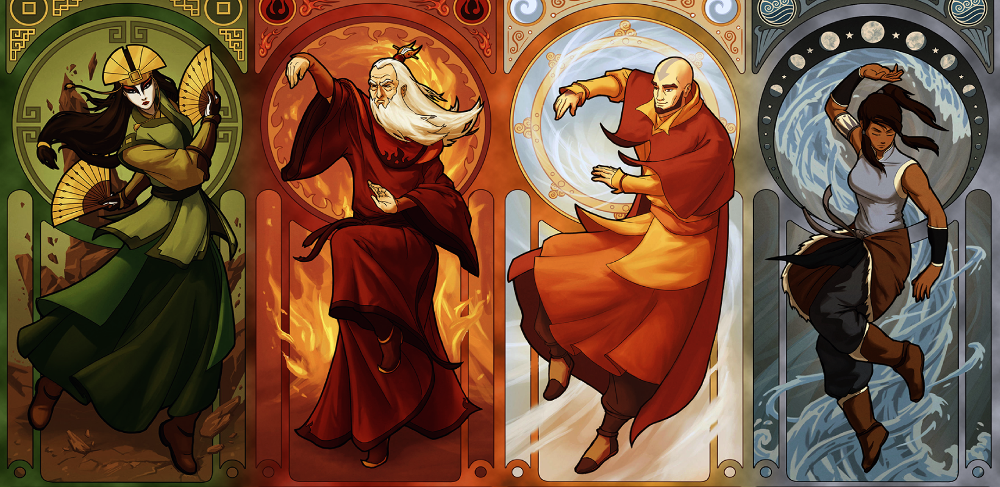

<h1 align="center">
	
 Hi, I'm Daniela Lara!
	
</h1>

  
  
  
  

<h2>

About me
	

</h2>

Experienced STEM woman 👩🏻‍💻 who adores Python and JavaScript 🐍💛. I'm a tech enthusiast 🤓, a coder, and a perpetual learner. Apart from programming, I love cooking 👩🏻‍🍳, art 🎨, reading 📖, music 🎷, gaming 🎮, and series 📺. Currently exploring cloud tech, machine learning, and AI 🤖 🧠. If you share my love for Python, JavaScript, and the thrill of learning, let's connect and code up a storm together! 😄 💻  

<h2>

Tech Stack
	

</h2>

  
My Tools and Software 🛠️ 

   
	

		
	

  
Frontend Technologies 🎨

   
  

  

  
Backend Technologies 💻

   
  

  

  
Other Technologies 🤓

   
  

  

My Top Languages 🏆

 

<b>Note:</b> Top languages is only a metric of the languages my public code consists of and doesn't reflect experience or skill level.

  

<h2>

	My Favorite Repos
	

</h2>

 

	
	
	
	
    	
  

  

<h2>

	My Stats
	

</h2>

  <!--- stats (start) -->
<table align="center">
<tr border="none">
<td width="50%" align="center">
  
  
    
   
</td>

<td width="50%" align="center">
 
  </td>
</tr>
<tr>
    <td colspan='2' align='center'>
	<h2> #30NitesOfCode </h2>
        
	 
	<a href='https://www.codedex.io/@lara-vel-dev/30-nites-of-code'>Check my progress!</a>
    </td>
</tr>
</table>

